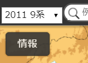

# SIMA Render Extension

地理院地図に測量データ共通フォーマット(旧版SIMA)をレンダリングする機能を追加します。

## 目的

測量データをそのまま載せられるようになるため案内図を作るのが簡単になります｡

## 必要なもの

- Node.js v8
- Git

## 使い方

まず sima-render-extension のリポジトリをクローンします。

```
git clone https://github.com/kmr-hryk/sima-render-extension.git
```

npm のパッケージをインストールしてビルドします｡

```
cd sima-render-extension
npm i
npm run release
```

最後に `npm run apply` すると地理院地図のリポジトリをクローンして必要なファイルを配置､読み込みの設定を追加します｡

```
npm run apply
```

カレントディレクトリにできた gsimaps ディレクトリを適当なウェブサーバーに設置するとアクセスできるようになります｡

アクセスしたらまず左上に出ているメニューから SIMA ファイルの測地系と座標系の組み合わせを選択してください｡



選択したら地図上に SIMA ファイルをドロップすると SIMA ファイルの画地データがレンダリングされます｡

## その他

この SIMA ファイルのレンダリング機能を追加しても GeoJSON のレンダリング機能は失われず､GeoJSON をドロップしてもレンダリングされます｡

SIMA の点データや結線データのレンダリングには対応していません｡前者はレンダリングされず､後者はポリゴンのようにレンダリングされます｡

npm でインストールされるパッケージの他に変換の機関部部は [sima2geojson.js](https://github.com/KMR-zoar/sima2geojson.js) のコードを内包しています｡

Internet Explorer で動作しませんでした｡

----
MIT License 2018 Hiroyuki Kimura.
